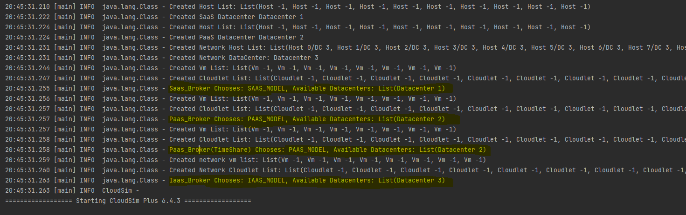
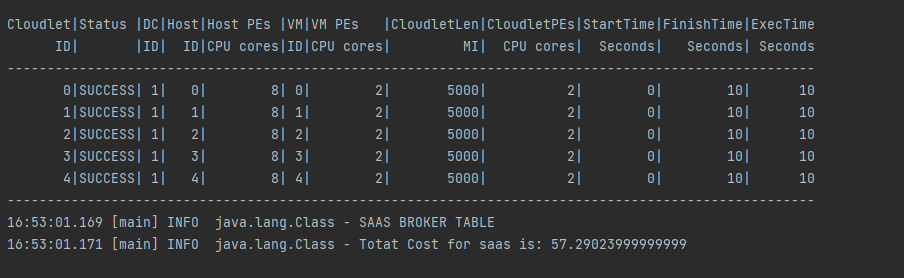
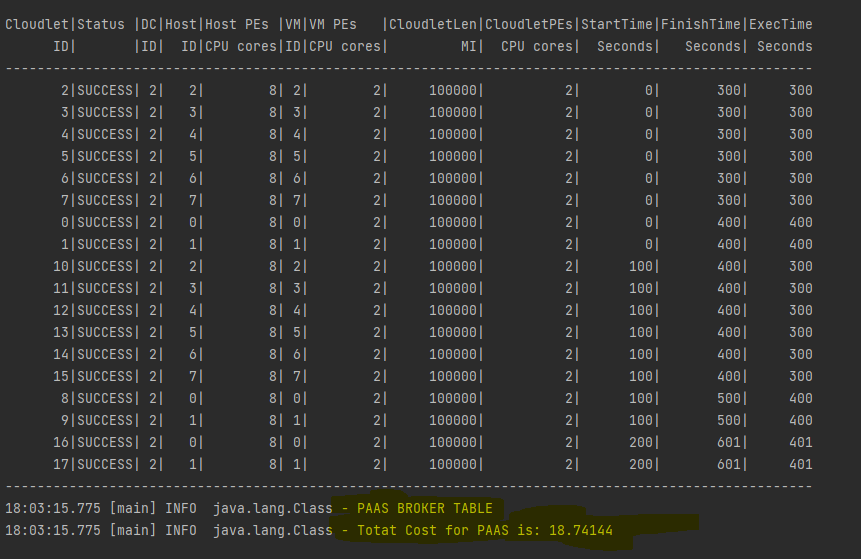
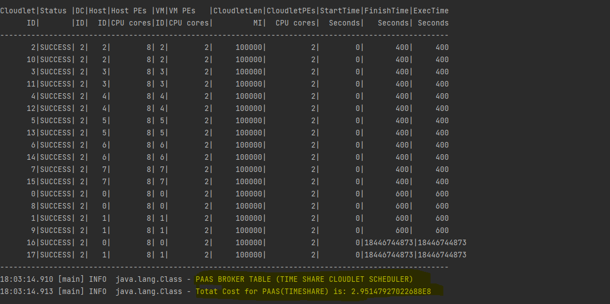
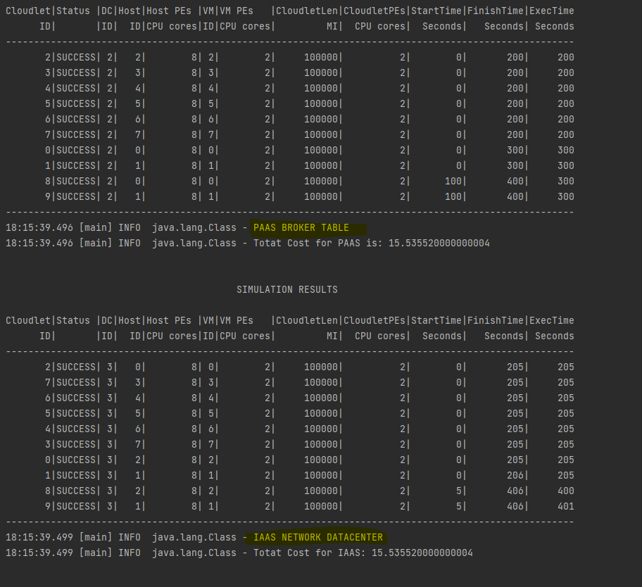

# TRU NGUYEN

## RUN TEST

```
1. Run sbt command
2. type 'test' and enter
```

## How To Use

```
1. clone and import project using IntelliJ
2. Run Simulation.scala > Choose 4 to run AlphaCloud simulation
```

```
1. Run sbt command
2. use run command > Choose 4 to run ALphacloud simulation
```

## Experimenting with cloudsim plus

1. VmAllocRR.scala
```
This file is the translation from the example of cloudsim.
It creates a datacenter using Round Robin to map vm into hosts in the datacenters
```

2. HorizontalScaling.scala
```
This file is also a translation from example of cloudsim.
It creates a datacenter capable of horizontal expansion by creating more vm when necessary.
```

## Code Structure of Alpha Cloud

1. application.conf
```
This file store all info about alphacloud
All the neccessary data locate inside of AlphaCloud Object
```

3. AlphaCloudUtil.scala
```
This file store utility method used in AlphaCloud.scala
```

3. CloudModelEnum.scala
```
This file store types of models used in AlphaCloud.scala
```

4. AlphaCloudletScheduler.scala
```
This file extends CloudletSchedulerAbstract and improve the default cloudletsheduler
```

5. AlphaCloudNetworkDatacenter.scala
```
Create Iaas network datacenter used in AlphaCloud.scala
```

6. AlphaCloud.scala
```
The main functionality of AlphaCloud. With many differnt datacenter models,
auto map the right broker to the right datacenter. Calculating cost, and 
showing the overall result of the simulation to show which is a good datacenter and which is not.
```

7. DeltaCloud.scala
```
It's sole purpose is to do analysis for different type of datacenters. 
All of the function are belong to AlphaCloud.scala 
```

9. AlphaCloudTest.scala
```
All of the neccessary Test.
```

## Infrastructure Of AlphaCloud

> It contains 3 datacenters, with 3 different brokers trying to get to the right datacenter.
> Each 3 datacenters are describe below.

1. SAAS structure
```
SAAS MODEL CONTAIN:
1. Obviously a datacenter with a simple allocation policy
2. List Of host that will eventually allocate into the DC (Simple Allocation)
3. List Of Vm which uses AlphaCloudletScheduler to schedule cloudlet
4. List of Cloudlet which represent software that the end users uses

In this schema the users doesn't allow to change anything, 
only and simply use what the default is or use what ever AlphaCloud provide them.
Since they don't have the need nor wanted to configure anything.
```

2. PAAS Models Structure
```
PAAS MODEL CONTAIN:
1. A datacenter.
2. List of Host allocate into the datacenter using Round Robin Allocation Policy.
3. List Of Vm Uses (AlphaCloudletScheduler or Timeshare).
4. List Of Cloudlet.

In this the users allow to change cloudlet scheduling policy, 
so there are 2 PaaS to demonstrate the efficiency of AlphaCloudletScheduling vs Timeshare.
```

3. IAAS Models Structure
```
PAAS MODEL CONTAIN:
1. A network datacenter which connect to EdgeSwitch.
2. List of network Host which will connect to one switch through ports.
3. List Of network Vm Uses AlphaCloudletScheduler.
4. List Of network Cloudlet which get map to a vm.

In this schema the users have the ability to access the infrasturue, 
manage the network switch on their own. Thus Broker can set host interval,
and achieve a better performance.
```

4. AlphaCloudletScheduler
```
This CloudletScheduler uses combination of bestfit and spaceshare. 
Whenever there is enough resouce for the cloudlet it will send the cloud let away. 
Also it has the ability to preempt cloudlet in execution state which take forever to start.
```

## AlphaCloud's Pricing

### SaaS Pricing
```
CostPerBW = 0.001
CostPerMem = 0.0013
CostPerSecond = 0
CostPerStorage = 0.001
softwareFeesPerSec = 0.00004

SaaS users are the same as other user, 
only different is that the datacenter have to implicitly calculate the price for Ram/Storage/Bandwidth.
Also the users also have to pay for the Software fee that we provide to them.
Beside the users already pay for software fee so we eliminate cost per second for the users
```

### PaaS And IAAS Pricing
```
CostPerBW = 0.001
CostPerMem = 0.0013
CostPerSecond = 0.001
CostPerStorage = 0.001

PaaS and IaaS users are technically the same, the only different is they have different authority on the DC.
So the prices for these 2 DC is the same.
```

## Analyze AlphaCloud

### AlphaCloudUtil (Map Broker To DC)

```
This logger was logged from file (AlphaCloudUtil.scala), 
show that Alphacloud can map the appropirate broker to the appropriate Datacenter.
SaaS broker mapped to SaaS DC
PaaS broker mapped to PaaS DC
IaaS Broker mapped to IaaS DC
Which were specified by the broker using CLoudModelEnum.
```

### Under-Provision

```
This image show the saas broker pay for what it doesn't uses. 
The broker have 8 Vm, but only uses 5 cloudlet which represent the software stacks.
This is called under-provisioning.
```


### AlphaCloudletScheduler vs Timeshare (From Top To Bottom Respectively)


```
If we tune the amount of cloudlet to 13.
We will expect the different performance between ALphaCloudletScheduler and CloudletSchedulerTimeShare. 
AlphaCloudletScheduler avg execution time is way better than of the timeshare cloudlet scheduler.
Moreover, no one is going to use a datacenter where the charge is off the roof. Therefore,
AlphaCloudletScheduler proven to be better than timeshare.
```

### IAAS vs PAAS

```
The Total time it take for IAAS to finish is relatively the same as PAAS. However,
if observe carefully, the start time in second in IAAS is much less than PAAS.
Because of the host scheduler interval that the broker IAAS set.
```

## Draw Back From AlphaCloud

### Elasticity
The AlphaCloud aren't capable of instantaneously allocate vm for the broker. 
Which mean, it can't scale vertically nor horizontally.