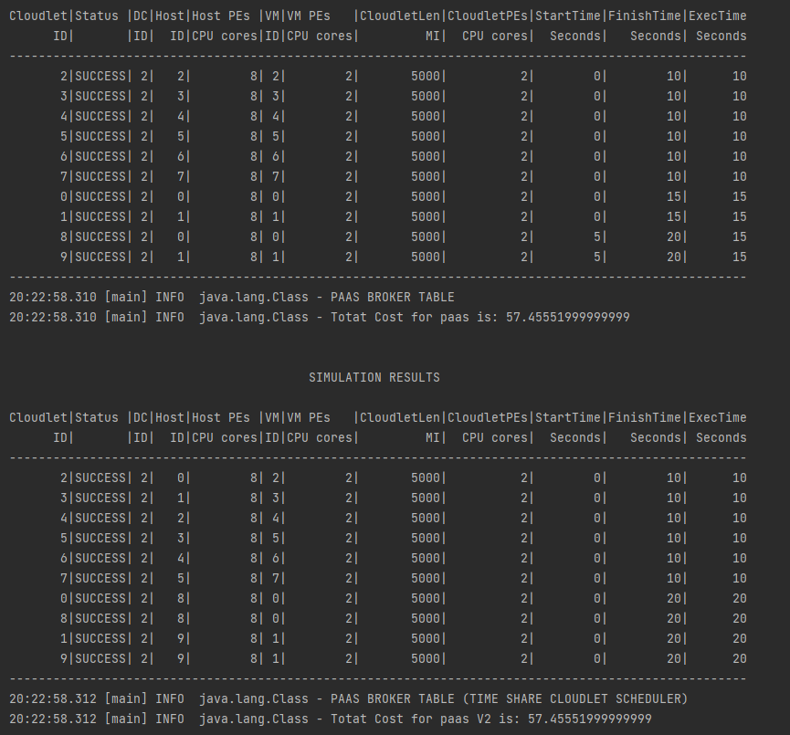
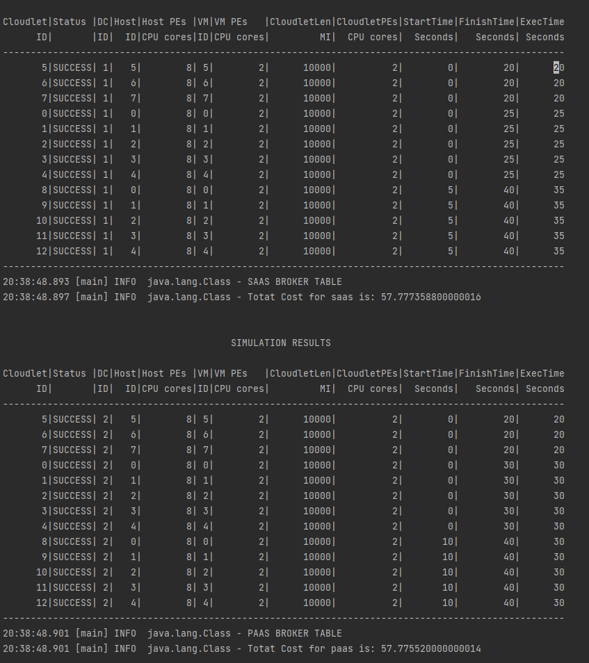

# TRU NGUYEN

## How To Use

1. clone and import project using IntelliJ
2. Run Simulation.scala > Choose 4 to run AlphaCloud Simulation

## Experimenting with cloudsim plus

1. VmAllocRR.scala
> This file is the translation from the example of cloudsim.
> It creates a datacenter using Round Robin to map vm into hosts in the datacenters

2. HorizontalScaling.scala
> This file is also a translation from example of cloudsim.
> It creates a datacenter capable of horizontal expansion by creating more vm when necessary.

## Code Structure of Alpha Cloud

1. application.conf
> This file store all info about alphacloud
> All the neccessary data locate inside of AlphaCloud Object

3. AlphaCloudUtil.scala
> This file store utility method used in AlphaCloud.scala

3. CloudModelEnum.scala
> This file store types of models used in AlphaCloud.scala

4. AlphaCloudletScheduler.scala
> This file extends CloudletSchedulerAbstract and improve the default cloudletsheduler

5. AlphaCloudNetworkDatacenter.scala
> Create Iaas network datacenter used in AlphaCloud.scala

6. AlphaCloud.scala
> The main functionality of AlphaCloud. With many differnt datacenter models,
> auto map the right broker to the right datacenter. Calculating cost, and 
> showing the overall result of the simulation to show which is a good datacenter and which is not.

## Infrastructure Of Simulation

1. SAAS structure
```
SAAS MODEL CONTAIN:
1. Obviously a datacenter with a simple allocation policy
2. List Of host that will eventually allocate into the DC (Simple Allocation)
3. List Of Vm which uses AlphaCloudletScheduler to schedule cloudlet
4. List of Cloudlet which represent software that the end users uses

In this schema the users doesn't allow to change anything, 
only and simply use what the default is or use what ever AlphaCloud provide them.
Since they don't have the need nor wanted to configure anything.
```

2. PAAS Models Structure
```
PAAS MODEL CONTAIN:
1. A datacenter.
2. List of Host allocate into the datacenter using Round Robin Allocation Policy.
3. List Of Vm Uses (AlphaCloudletScheduler or Timeshare).
4. List Of Cloudlet.

In this the users allow to change cloudlet scheduling policy, 
so there are 2 PaaS to demonstrate the efficiency of AlphaCloudletScheduling vs Timeshare.
```

3. IAAS Models Structure
```
PAAS MODEL CONTAIN:
1. A network datacenter which connect to EdgeSwitch.
2. List of network Host which will connect to one switch through a port.
3. List Of network Vm Uses AlphaCloudletScheduler.
4. List Of network Cloudlet.

In this schema the users have the ability to access the infrasturue, 
manage the network switch on their own.
```

4. AlphaCloudletScheduler
```
This CloudletScheduler uses combination of bestfit and spaceshare. 
Whenever there is enough resouce for the cloudlet it will send the cloud let away. 
Also it has the ability to preempt cloudlet in execution state which take forever to start.
```

## Analyze AlphaCloud

### AlphaCloudUtil (Map Broker To DC)

```
This logger was logged from file (AlphaCloudUtil.scala), 
show that Alphacloud can map the appropirate broker to the appropriate Datacenter.
SaaS broker mapped to SaaS DC
PaaS broker mapped to PaaS DC
IaaS Broker mapped to IaaS DC
Which were specified by the broker using CLoudModelEnum.
```

### Under-Provision

```
This image show the saas broker pay for what it doesn't uses. 
The broker have 8 Vm, but only uses 5 cloudlet which represent the software stacks.
This is called under-provisioning.
```


### AlphaCloudletScheduler vs Timeshare (From Top To Bottom Respectively)

```
If we tune the amound of cloudlet up to 10, and keep every thing the same.
We will expect the different performance between ALphaCloudletScheduler and CloudletSchedulerTimeShare. 
AlphaCloudletScheduler avg execution time is way better than of the timeshare cloudlet scheduler.
```
> NOTE: If we tuned amount of cloudlet to about 20, timeshare execution time will be off the roof.
> However alphaCloudletScheduler still have a good performance.

### Vm simple allocation vs Vm Round Robin allocation (From Top To Bottom Respectively)

```
If we tuned the cloudlet length to 10,000 and the amount of cloudlet to 13. We can observe that
the Simple Vm allocation isn't efficient in spreading the task evenly among the vm; As to the Round Robin Vm Allocation, 
it spread the task out evenly even though the total execution time is the same.
```

### IaaS


## Draw Back From AlphaCloud

# Elasticity